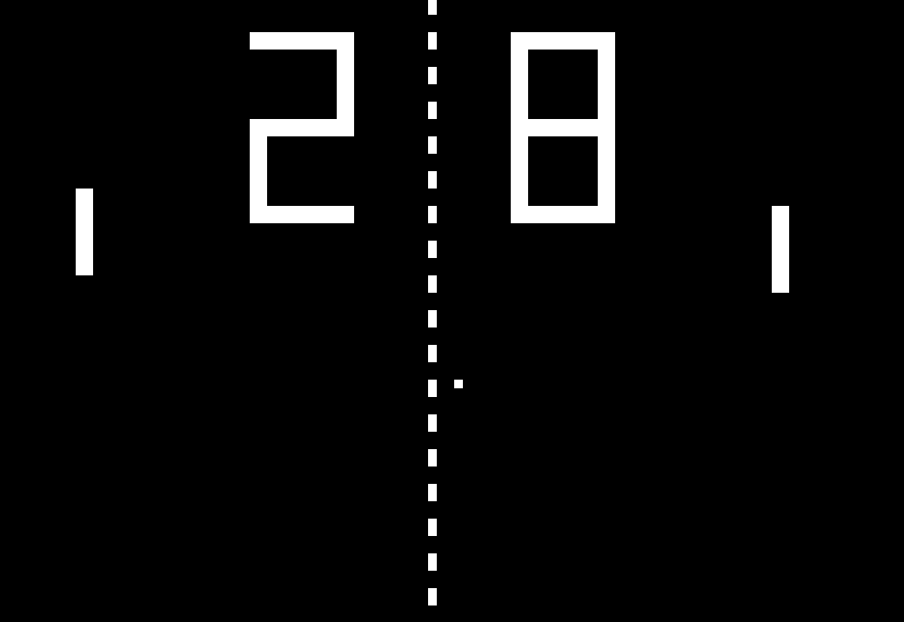

## phaser-mvc

An MVC framework for Phaser.

note: this is only for testing purposes

## install

```npm install phaser-mvc```

## Take a look to examples at [/examples](./examples)




## How to use

```javascript
// app.ts
import { Bootstrap } from 'phaser-mvc';
import { StartupController } from './controllers/startup_controller';

/*
 * Bootstrap game
 */
window.onload = () => {
  let witcase = Witcase.create<Phaser.Game>();

  witcase.start((baseEngine: BaseEngine)=> {
    const game = new Phaser.Game(
      1000,
      750,
      Phaser.CANVAS,
      'content',
      {
        preload: () => {
          game.scale.scaleMode = Phaser.ScaleManager.SHOW_ALL;
          game.physics.startSystem(Phaser.Physics.P2JS);
          game.physics.p2.gravity.y = 100

          //wait until Phaser is ready to create first controller
          witcase.defaultAction = Container.get(GameController).startGame;
          baseEngine.preload();
        },
        create: () => {
          baseEngine.create();
        },
        update: baseEngine.update,
        render: baseEngine.render
      }
    );

    return game;
  });
};
```

```javascript
// controllers/startup_controller.ts
import { IViewMap } from 'phaser-mvc';
import { Controller } from 'phaser-mvc';
import { StartupView } from '../views/startup_view';

/**
 * Startup controller
 */
export class StartupController extends Controller {
  private startupView: StartupView;

  constructor(){
    super();
    this.startupView = new StartupView(this);
    this.startupView.welcomeMessage = 'Hello world!';
  }

  public welcome = () => {
    this.startupView.show();
  }
}
```

```javascript
// views/startup_view.ts
import { View } from 'phaser-mvc';
import { Controller, ViewComponentAdder } from 'phaser-mvc';

/**
 * Startup View
 */
export class StartupView extends View {
  public welcomeMessage: string;

  public create(_componentAdder: ViewComponentAdder) {
    this.game.add.text(100,
                       100,
                       this.welcomeMessage,
                       { fill: '#fff' });
  }
```

Update view on model change:
```
  public updateOnModelChange(watchFactory: WatchFactory){
    watchFactory.create<number>(() => this.cannon.angle).subscribe(this.rotateCannon);
  }

  private rotateCannon = (angle: number) => {
    this.cannonSprite.angle = angle;
  }
```

Subscrive controllers to views input events:
```
// view
import { View, ViewComponentAdder, WatchFactory, ViewNotifier } from 'phaser-mvc';

/**
 * Players Keys View
 */

export class PlayerKeysView extends View {
  rotateCannon: ViewNotifier<string> = new ViewNotifier<string>();
  rotateCannonStop: ViewNotifier<void> = new ViewNotifier<void>();
  launchHuman: ViewNotifier<void> = new ViewNotifier<void>();

  public updateOnModelChange(watchFactory: WatchFactory){
    watchFactory.create<[boolean, boolean]>(() => [
      this.game.input.keyboard.isDown(Phaser.Keyboard.LEFT),
      this.game.input.keyboard.isDown(Phaser.Keyboard.RIGHT)
    ]).subscribe(this.moveCannon);
  }

  private moveCannon = (areKeysDown: [boolean, boolean]) => {
    if (areKeysDown[0]) this.rotateCannon.publish('clockwise');
    else if (areKeysDown[1]) this.rotateCannon.publish('counter-clockwise');
    else this.rotateCannonStop.publish();
  }
}
```

```
// Controller
    this.playerKeysView.rotateCannon.subscribe(this.rotateCannon);
    this.playerKeysView.rotateCannonStop.subscribe(this.rotateCannonStop);
    this.playerKeysView.launchHuman.subscribe(this.launchHuman);
```

## License

MIT license; see [LICENSE](./LICENSE).

(c) 2017 by Hugo Freire
